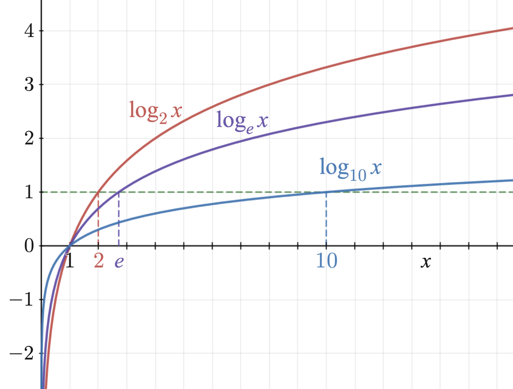
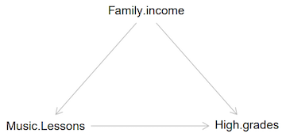

### Learning objectives for today

1) Introduction to linear regression
    - How do we find the line of best fit?
    - What is the slope?
    - What is the intercept?
    - What is the $r^2$?

2) Use R to run a linear regression and add a regression line to a scatter plot

3) Learn how to transform non-linear data so that we can use linear regression

4) Learn how outliers influence the line of best fit

5) Understand why: 
    - Association does not necessarily mean causation
    - We should not extrapolate beyond our data
    - We should always consider potential **confounders** in our interpretation
    - We should use data visualization to confirm the shape of the relationship


### Readings

* [Chapter 4 of Baldi & Moore](https://ebookcentral-proquest-com.libproxy.berkeley.edu/lib/berkeley-ebooks/reader.action?docID=6643934&ppg=198)
* [Simple Linear Regression](https://moderndive.com/5-regression.html) (See [section 5.1.2](https://moderndive.com/5-regression.html#model1table))
* [R Squared](https://statsthinking21.github.io/statsthinking21-core-site/the-general-linear-model.html#linear-regression) (See [section 14.1.5](https://statsthinking21.github.io/statsthinking21-core-site/the-general-linear-model.html#quantifying-goodness-of-fit-of-the-model))

### What is a regression line?

- A straight line that is **fitted** to data to minimize the distance between 
the data and the fitted line
- It is often called the **line of best fit**
- It is also called the **least-squares regression line **  (sometimes refered
to as **ordinary least squares** or **OLS**)  this is because, mathematically, 
the criteria for choosing this line is based on the sum of squares of the 
vertical distances from the line.  We choose the line that minimizes this sum.

### What is a regression line?

Once we calculate this line, it can be used to describe the relationship between
the explanatory and response variables.

- *Can* you fit a line of best fit for non-linear relationships? *Should* you?
- Very important to visualize the relationship first. Why?

### Equation of the line of best fit

The line of best fit can be represented by the equation for a line:

$$y = a + bx$$

where $a$ is the **intercept** and $b$ is the **slope**.

This equation encodes a lot of useful information. 

Note: You might have learned this as: $y = mx + b$, where $b$ is the intercept and $m$ is the slope. In this class we use the previous notation (shown above), but all the same concepts apply. 

**Beware!** Notice the unfortunate overlap of the $b$ variable, that, in the line equation, represents the *intercept*, while in the regression model, represents the *slope*. 


### Equation of the line of best fit: the intercept

$$y = a + bx$$

If $x=0$, the equation says that $y=a$. That is, the line of best fit crosses the y-axis at the value $a$. That is, $a$ is where the line of best fit intercepts the y-axis, hence, it is the intercept. 

* Is the value of the intercept always meaningful? 

### Equation of the line of best fit: the slope

$$y = a + bx$$

In the regression model $b$ is known as the slope because an increase from $x$ to $x+1$ is associated with an increase in $y$ 
by the amount $b$.

We can write the slope as a function of the Pearson correlation coefficient which we talked about last class:

$$b=r\frac{s_y}{s_x}$$
Where $r$ is the Pearson correlation coefficient, $s_y$ is the standard deviation of the $y$ variable and $s_x$ is the standard deviation of the $x$ variable.

Note that this means that the Pearson correlation coefficient and the slope will always have the same sign (e.g., if the Pearson correlation coefficient is positive then $b$ will also be positive)

### The R-squared value

- The $r^2$ value or R-squared, is the fraction of the variation in the values of $y$ that is explained by the regression of $y$ on $x$

- If all points in a scatter plot between X and Y fall exactly on the regression line, the value of $r^2$ is $1$.

- Note that $r^2$ is the Pearson correlation coefficient squared

### Fitting a linear model in R

**Code to run a linear model:** `lm(y ~ x, data = your_data)`

- `lm()` is the function for fitting a linear model.
- The first argument that `lm()` wants is a **formula**: `y ~ x`.
    - `y` is the **response variable** from your dataset (i.e., what you are trying to predict)
    - `x` is the **explanatory variable** (i.e., what you are using to make a prediction)
    - be careful with the order of x and y! It is opposite from the default order in `ggplot` when we write `ggplot(data, aes(x = your_x, y = your_y))`
- The second argument sent to `lm()` is the data set.
    - the default order for declaring the data as the second argument in `lm()` is different from `ggplot2` and `dplyr` functions

### Fitting a linear model in R

Code template:

```{r lm-template, eval=F}
# Students, if you copy this code chunk, you need to set eval = T in the code chunk header for the code to compile

your_lm <- lm(formula = y ~ x, data = your_dataset)

library(broom) # This package makes the output from the linear model look clean 
tidy(your_lm) # This function from the broom package tidies up the output that is printed to the screen
```

### Why the package broom?

```{r, echo=F, fig.align='center'}

```

* `broom` has functions that make the output from the linear model look clean 
* `tidy` is a function from the `broom` package that tidies up the output

```{r, eval=F}
# Students, if you copy this code chunk, you need to set eval = T in the code chunk header for the code to compile

your_lm <- lm(formula = y ~ x, data = your_dataset)

library(broom)
tidy(your_lm) 
```

### Manatee deaths and powerboat registrations 

Let's apply the `lm()` function. Recall the [manatee example from Ch.3](https://ebookcentral-proquest-com.libproxy.berkeley.edu/lib/berkeley-ebooks/reader.action?docID=6643934&ppg=159) that 
examined the relationship between the number of registered `powerboats` and the 
number of manatee `deaths` in Florida between 1977 and 2016.

```{r load-mana-data, echo=F, message=F}
library(readr)
mana_data <- read_csv("./data/Ch03_Manatee-deaths.csv")
```

* Recall that the relationship was linear by examining the scatter plot

* This is the relationship between number of powerboat registrations (in thousands) and manatee deaths (see above for link to online textbook)

```{r scatter-plot-mana, out.width="80%"}
library(ggplot2)
ggplot(mana_data, aes(x = powerboats, y = deaths)) +
  geom_point() +
  theme_minimal(base_size = 15) 
```

### lm() of manatee deaths and powerboat purchases

Calculate the line of best fit: 

```{r run-linear-model-mana}
mana_lm <- lm(deaths ~ powerboats, mana_data)

library(broom) 
tidy(mana_lm) 
```

- Only pay attention to the "term" and "estimate" columns for now.

**Interpret the model output**

- **Intercept**: The predicted number of deaths if there were no powerboat registrations. But the
prediction is negative. Why?
- **powerboats**: This is the **slope** of the line. It is labelled "powerboats" because in more 
advanced models we can have multiple `X` explanatory variables and have a slope
for each one. 
- Question: What does the estimated slope for powerboats mean? Remember that the variable `powerboats` needs to be multiplied by 1,000 -- e.g., if it says that $powerboats=447$ this means that $447 \times 1,000 = 447,000$ powerboats were registered in that year.

### Interpret the model output 

- Question: What does the estimate slope for powerboats mean? Remember that the variable `powerboats` needs to be multiplied by 1,000 -- e.g., if it says that $powerboats=447$ this means that $447 \times 1,000 = 447,000$ powerboats were registered in that year.
- Answer: A one unit change in the number of powerboats registered (multiplied 
by 1,000) is associated with an increase of manatee deaths of 0.136. That is, 
a 1,000-unit increase in the number of powerboats registered is associated with 0.136 more manatee deaths.

### Check your understanding!

If powerboat registration increased by 100,000, then how many more manatee deaths are expected?

```{r, echo=F, eval=F}
# Answer: Because we expect a 0.1358 increase in the number of deaths for every increase of 1000 in the number of powerboats registered, for an increase of 100,000 we would expect 13.58 deaths, which we can round to 14 deaths since you can't have a fraction of a death.
```

### Add the regression line to the scatter plot using `geom_abline()`

- What parameters do we pass `geom_abline()`?
- Notice that we cannot see the y-intercept in this plot. This is because `ggplot` only shows the plotting region that corresponds to the range of the data. Here, the range of the data is far from where $x=0$, so we cannot see where the line of best fit crosses the y axis. 
```{r scatter-with-line-of-best-fit, out.width="80%"}
# students, know how to use geom_abline() to add a line to scatterplot
# students do not need to know the coord_fixed command.

default_zoom_plot <- ggplot(mana_data, aes(x = powerboats, y = deaths)) +
  geom_point() + 
  labs(x = "Powerboats registered (x 1,000)",
       y = "Manatee deaths") +
  geom_abline(intercept = -46.7520, slope = 0.1358) + 
  coord_fixed(ratio = 5) +
  theme_minimal(base_size = 15)

default_zoom_plot
```

### Change the plotting region to show the y intercept

- We can add `scale_x_continuous(limits = c(0, 1050))` to the `ggplot` to force the plot canvas to show a range of data going from `x=0` to `x=1050.`
- Now we can see the intercept estimate. It is where the line of best fit 
intersects the y axis. Should we interpret it?
- It is far from the bulk of the data, there is no data near `powerboats = 0`
- Interpretation would be **extrapolation**, which is **not supported** by these data

```{r zoom-out-plot, out.width="80%", echo = F}
# The code below (not shown in the slides) changes the range of the X and Y axes
# So that we can see the y intercept. It also adds green axes lines.
# Students don't need to know how to change the plotting region, but it may help them when interpeting their regression models!

zoom_out_plot <- ggplot(mana_data, aes(x = powerboats, y = deaths)) +
  geom_hline(yintercept = 0, col = "forest green") + 
  geom_vline(xintercept = 0, col = "forest green") +
  geom_point() + 
  labs(x = "Powerboats registered (x 1,000)",
       y = "Manatee deaths") +
  geom_abline(intercept = -46.7520, slope = 0.1358) + 
  scale_x_continuous(limits = c(0, 1050)) + 
  scale_y_continuous(limits = c(-50, 110)) + 
  coord_fixed(ratio = 6) +
  theme_minimal(base_size = 15)

zoom_out_plot
```

### R-squared

- When we run a linear model, we also calculate $r^2$ 
- `glance()` is a function from `broom`. It shows the $r^2$ for the manatee data:

```{r, glance-at-model}
glance(mana_lm)
```

Focus on:

- Column called `r.squared` only.
- Interpretation of r-squared: 89.3% of the variation in manatee deaths is explained by 
variation in the number of motorboats.

### High r-squared values in public health

An $r^2$ of 89.3% is very high! In public health, it is rare for us to
see an $r^2$ value so high when we have only one independent variable in the model.

One hypothetical example in public health that may have a high $r^2$ is:

* x-value: Percent of the population that are vaccinated against HPV each year
* y-value: Incidence of new cases of cervical cancer each year among the vaccine-eligible population

Because 91% of cervical cancer is estimated to be caused by HPV, as vaccination 
against HPV increases, the number of new cases of cervical cancer will go down and
be strongly related to the percent vaccinated. If this relationship were linear (we would need to check the plot for linearity!), we would anticipate its $r^2$ value to be high.

### Example using transformed data

- Sometimes, the data is transformed to another scale so that the relationship
between the transformed $x$ and $y$ is linear
- [Table 3.5 in the textbook](https://ebookcentral-proquest-com.libproxy.berkeley.edu/lib/berkeley-ebooks/reader.action?docID=6643934&ppg=192) provides data on the mean number of seeds produced in a year by several common tree species and the mean weight (in milligrams) of the seeds 
produced. 

```{r make-seed-dataset}
# Students, you don't need to know how to make a tibble data frame
# Just know how to look at this code and see that a data frame is being created.
library(tibble)
seed_data <- tribble(~ species, ~ seed_count, ~ seed_weight,
                       "Paper birch", 27239, 0.6,
                       "Yellow birch", 12158, 1.6,
                       "White spruce", 7202, 2.0,
                       "Engelman spruce", 3671, 3.3, 
                       "Red spruce", 5051, 3.4, 
                       "Tulip tree", 13509, 9.1, 
                       "Ponderosa pine", 2667, 37.7, 
                       "White fir", 5196, 40.0, 
                       "Sugar maple", 1751, 48.0, 
                       "Sugar pine", 1159, 216.0, 
                       "American beech", 463, 247, 
                       "American beech", 1892, 247,
                       "Black oak", 93, 1851, 
                       "Scarlet oak", 525, 1930, 
                       "Red oak", 411, 2475, 
                       "Red oak", 253, 2475,
                       "Pignut hickory", 40, 3423, 
                       "White oak", 184, 3669, 
                       "Chestnut oak", 107, 4535)
```

### Scatter plot of `seed_weight` vs. `seed_count`

```{r, out.width="80%"}
ggplot(seed_data, aes(seed_count, seed_weight)) + 
  geom_point() +
  theme_minimal(base_size = 15)
```

- `seed_count` and `seed_weight` both vary widely
- Their relationship is not linear

### Using logarithms to transform variables

Why might we want to transform variables using logarithms?

- Makes small numbers bigger (in magnitude), and big numbers smaller
- Great for variables with orders of magnitude in the data range
- Helpful for numerical reasons: computers have problems with numbers that are very large or very small
- The natural logarithm has convenient mathematical properties

```{r, echo=F, fig.align='center'}
# By Richard F. Lyon - made myself, alt version of Logarithm plots.svg with better text, CC BY-SA 3.0, https://commons.wikimedia.org/w/index.php?curid=13257335

```

### Investigate the relationship between the logarithm of the variables

- Add transformed variables to the dataset using `mutate()`. 
- We add both the natural logarithm (i.e., $log_e$ or 'log base $e$' and $log_{10}$ variables for illustration

```{r calc-logged-vars, message=F, warning=F}
library(dplyr)
seed_data <- seed_data %>% mutate(log_seed_count = log(seed_count),  # base e
                                  log_seed_weight = log(seed_weight), # base e
                                  log_b10_count = log(seed_count, 10), # base 10
                                  log_b10_weight = log(seed_weight, 10)) # base 10
```

### Plot transformed data using $log_e$

```{r scatter-logged, out.width="50%"}
ggplot(seed_data, aes(log_seed_count, log_seed_weight)) + 
  geom_point() +
  labs(x = "Log of seed count", y = "Log of seed weight", 
       title = "Using the natural logarithm (log base e)") +
  theme_minimal(base_size = 15)
```

### Plot transformed data using $log_{10}$

```{r scatter-log-base10, out.width="50%"}
ggplot(seed_data, aes(log_b10_count, log_b10_weight)) + 
  geom_point() +
  labs(x = "Log of seed count", y = "Log of seed weight", 
       title = "Using log base 10") +
  theme_minimal(base_size = 15) 
```

- You can use either $log_{10}$ or $log_e$ for class
- Algebraic manipulations using $log_e$ are easier 


### What happens if we only transform one of the variables?

What is the relationship between the logarithm of seed count and seed weight (not log transformed)?

```{r another-plot, out.width="50%"}
ggplot(seed_data, aes(log_b10_count, seed_weight)) + 
  geom_point() +
  labs(x = "Logarithm of seed count", y = "seed weight", 
       title = "Using log base 10") +
  theme_minimal(base_size = 15) 
```

For these specific variables, just transforming one of them does not make the relationship between the variables linear. We needed to transform both x and y for the relationship to be linear. 

Be careful! You don't always need to transform both x and y variables! Sometimes 
you need to only transform x or only transform y. To figure this out, try different combinations of transformations and plotting them. Pick the set up such that the plot shows a linear relationship

### `lm()` on the $log_e$ variables

```{r run-linear-model-seed}
seed_mod <- lm(log_seed_weight ~ log_seed_count, data = seed_data)
tidy(seed_mod)
glance(seed_mod) %>% pull(r.squared)
```

- Interpret the intercept:
- Interpret the slope: 

### `lm()` on the $log_e$ variables

```{r run-linear-model-seed-2}
seed_mod <- lm(log_seed_weight ~ log_seed_count, data = seed_data)
tidy(seed_mod)
glance(seed_mod) %>% pull(r.squared)
```

- Interpret the intercept: When the natural logarithm of the number of seeds is zero, the natural logarithm of the weight of the seeds is estimated to be 15.5 milligrams.
- Interpret the slope: A one unit change in the natural logarithm of the number of seeds is associated with a 1.52 unit decrease in the natural logarithm of the weight of the seeds in milligrams

- Does the intercept interpretation make any sense in this context?

### `lm()` on the $log_{10}$ variables

```{r run-linear-model-seed-b10}
seed_mod_b10 <- lm(log_b10_weight ~ log_b10_count, data = seed_data)
tidy(seed_mod_b10)
glance(seed_mod_b10) %>% pull(r.squared)
```

- What is different from the $log_e$ output?

### Interpretation of `lm()` when using $log_e$ data

- We use the results of the `lm()` on the $log_e$ transformed data for making 
predictions
- E.g., what seed weight is predicted for a seed count of 2,000?
- Worked calculation:

1. Write down the line of best fit: $log_e(seed.weight) = 15.49130 - 1.522220\times{log_e(seed.count)}$
2. Plug in $seed.count = 2,000$ into the line of best fit: $log_e(seed.weight) = 15.49130 - 1.522220\times{log_e(2,000)}$
3. Solve for seed count by exponentiating both sides: 
$$seed.weight = e^{(15.49130 - 1.522220\times{log_e(2,000)})}$$ (this uses the property that $e^{log_e(x)}=x$)
$$seed.weight = 50.45$$
4. Interpret: Seeds are expected to weigh 50.45 mg for trees having a seed count of 2,000.

**Make sure you can do this worked calculation on a calculator or using R.**


### How do outliers affect the line of best fit?

To study this, we use data from the Organisation for Economic Co-operation and 
Development (OECD). This dataset was downloaded from http://dx.doi.org/10.1787/888932526084 
and contains information on the health expenditure per capita and the GDP per
capita for 40 countries. 

```{r read-spending-data}
library(readxl)

spending_dat <- read_xlsx("./data/Ch04_Country-healthcare-spending.xlsx", 
                          sheet = 2,
                          range = "A7:D47")
```

### Have a look

Next, we want to examine the imported data to see if it is how we expect:
```{r examine-spending-data}
str(spending_dat)
head(spending_dat)
```

### Rename() some variables to use a consistent naming style

If the variable name has spaces, we must use back ticks when referring to it:

```{r rename-variables-with-spaces}
library(dplyr)
spending_dat <- spending_dat %>% 
  rename(country_code = Country.code,
         health_expenditure = `Health expenditure per capita`, # back ticks
         GDP = `GDP per capita`) # back ticks
```

### Examine the relationship

Make a scatter plot of `health_expenditure` (our response variable) vs. each country's level of `GDP`:

```{r plot-spending-data}
#install.packages("ggrepel")
library(ggrepel) #this library is used for adding labels to a scatter plot that don't overlap the data points

ggplot(spending_dat, aes(x = GDP, y = health_expenditure)) + 
  geom_point() +
  geom_text_repel(aes(label = country_code)) +
  theme_minimal(base_size = 15)
```

### Examine the relationship

Is the relationship linear? Which countries are outliers? 

Fit a linear model to these data and add it to the graph:

```{r fit-lm-and-plot}
lm(health_expenditure ~ GDP, data = spending_dat)

ggplot(spending_dat, aes(x = GDP, y = health_expenditure)) + 
  geom_point() +
  geom_text_repel(aes(label = country_code)) + # this adds the country code as a label 
  geom_abline(intercept = 44.65623, slope = 0.09399, lty = 2) +
  theme_minimal(base_size = 15)
```

### Examine the relationship without Luxembourg in the data

Let's see whether removing Luxembourg changes the fit of the line. We can remove 
Luxembourg using the `filter()` command from `dplyr`:

```{r remove-lux-and-save-new-dataset}
spending_dat_no_LUX <- spending_dat %>% filter(country_code != "LUX")

lm(health_expenditure ~ GDP, data = spending_dat_no_LUX)

ggplot(spending_dat, aes(x = GDP, y = health_expenditure)) + geom_point() +
  geom_text_repel(aes(label = country_code)) + 
  geom_abline(intercept = 44.65623, slope = 0.09399, lty = 2) + 
  geom_abline(intercept = -785.1044, slope = 0.1264, col = "red") +
  theme_minimal(base_size = 15)
```

### Examine the relationship without USA in the data

```{r remove-usa-and-save-new-dataset}
spending_dat_no_USA <- spending_dat %>% filter(country_code != "USA")

lm(health_expenditure ~ GDP, data = spending_dat_no_USA)

ggplot(spending_dat, aes(x = GDP, y = health_expenditure)) + geom_point() +
  geom_text_repel(aes(label = country_code)) + 
  geom_abline(intercept = 44.65623, slope = 0.09399, lty = 2) + 
  geom_abline(intercept = 152.26274, slope = 0.08714, col = "blue") +
  theme_minimal(base_size = 15)
```

### Examine the relationship without LUX or USA in the data

Let's remove both the USA and LUX and see how it affects the fit:

```{r remove-usa-lux}
spending_dat_no_USA_LUX <- spending_dat %>% filter(country_code != "USA" & country_code != "LUX")

#alternatively, you could have written:
spending_dat_no_USA_LUX <- spending_dat %>% filter(! country_code %in% c("USA", "LUX"))

#pick the filter command that makes the most sense to you.

lm(health_expenditure ~ GDP, data = spending_dat_no_USA_LUX)

ggplot(spending_dat_no_USA_LUX, aes(x = GDP, y = health_expenditure)) + geom_point() +
  geom_text_repel(aes(label = country_code)) + 
  geom_abline(intercept = 44.65623, slope = 0.09399, lty = 2) + 
  geom_abline(intercept = -592.6973, slope = 0.1166 , col = "green") +
  theme_minimal(base_size = 15)
```

What would happen if USA's point had actually been along the original line of 
best fit (say at x = 80000 and y = 7500) and we re-fit the line without USA's 
point? Would USA have been an **outlier**? Would it be considered **influential**?

### But, is it causal? 

- Creating a scatter plot and a simple linear model is an important step in many 
analyses. It allows you to see the relationship between two quantatitive 
variables and estimate the line of best fit. 

- Sometimes these relationships will be used to make claims of causality. Baldi 
& Moore emphasize that experiments are the best way to study causality. While 
this is often true, sophisticated causal methods have been developed for the 
analysis of observational data. 

### Discussion of some examples from earlier edition of Baldi & Moore

(see ["Association does not imply causation"](https://ebookcentral-proquest-com.libproxy.berkeley.edu/lib/berkeley-ebooks/reader.action?docID=6643934&ppg=228) for examples from the online texbook)

**Example 4.7 "Nature, nuture, and lurking variables"** presents an 
advertisement from the Michigan Symphony

"Question: Which students scored 51 points higher in verbal skills and 39 points 
higher in math? 

Answer: Students who had experience in music."

Marketers often make leading statements that make their product or service sound
appealing. The purpose of this ad was to have the target audience impute that 
music causes higher marks at school because there is an association between 
enrollment in music and higher marks. However, are students enrolled in music 
lessons otherwise the same as students not enrolled in music lessons? What else
do you expect to differ between these groups of students?

### Discussion of some examples from Baldi & Moore

We can encode these differences in a causal diagram. Here is a simple one to demonstrate the concept:

```{r dag, echo=F, fig.height=4, fig.width=8, fig.align='center'}

```

The forking at the "Family Income" node makes explicit that we believe family 
income to be a confounder of the relationship between taking music lessons and 
achieving higher grades. It means that not only do these children take music 
lessons, they also come from families with higher incomes, and higher incomes 
lead to higher grades in other ways. Of course, family income is not the only 
possible confounder. What are some others? 

### Confounding

In this course, we don't address how to control for confounding or other types 
of bias that limit causal interpretations. However, know that causality can be 
studied using observational data and relies on clever study designs and 
oftentimes on advanced methods. 


