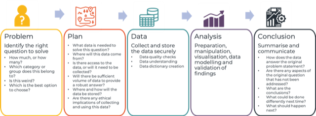
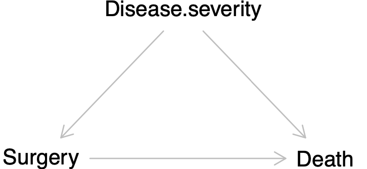
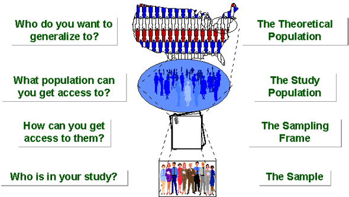

```{r, include=FALSE}
library(knitr) # for include_graphics() 
library(dplyr)
```

### Important Note

There are several definitions and descriptions in [Chapter 6](https://ebookcentral-proquest-com.libproxy.berkeley.edu/lib/berkeley-ebooks/reader.action?docID=6643934&ppg=284) that are described poorly:

- Section "Observation vs. Experiment": text-box and following paragraph
- Definition of confounding text-box and Figure 6.1 (conceptual diagram of confounding)
- Description of bias text-box

For the concepts around sampling studies, observational studies, and study design in general, 
for these sections, and for the definitions of causality and confounding, **the material presented in lecture takes precedence**

### Learning objectives for today

Defining a study by:

- Whether the treatment or exposure is controlled by an investigator
    - Experimental vs observational designs
- The population of interest
    - Target population
    - Study population
    - Study sample
- How the sample was drawn from the population      
    - Complete sample (census)
    - Random sampling
    - Convenience sampling
    - Volunteer sampling
- Method and timing of data collection

### Types of problems:  from our PPDAC framework

```{r ppdac, echo=F, out.width = "50%", fig.align='center'}

```
(figure from [dataschools.education](https://dataschools.education/about-data-literacy/ppdac-the-data-problem-solving-cycle/))

- Recall the three types of studies we conduct: 
    - Descriptive
    - Predictive
    - Causative/Etiologic
    
- The book argues that experiments are "the only source of fully convincing data" to study causes and effect
- However, epidemiologists, sociologists, political scientists, economists, and others use observational data to study cause and 
effect and have developed a careful theory of causal inference that this textbook doesn't consider
- These studies *can* be used to study cause and effect:
  - Smoking on lung cancer
  - HPV on cervical cancer
- Even if an experimental study is possible, there may be ethical or practical concerns that favor an observational study

### Observation vs. Experimentation

- A study is observational if the researcher **observes** what happens and does
not control who is treated or exposed
- A study is experimental if the investigator is **experimenting** (or 
intervening) by controlling who is treated or exposed
- In an experimental study, the exposure is assigned by a randomization 
mechanism that is controlled by the investigator

### Observation vs. Experimentation

- Example 6.1 in Baldi & Moore presents an example of observational vs. experimental data. Researchers studied the causal effect of hormone replacement therapy on cardiovascular disease. The initial experimental study seemed to contradict the observational studies, while a later experimental study from a more representative sample supported the observational data. Furthermore, the observational data [analyzed in a 
different way yield the same conclusion](https://www.ncbi.nlm.nih.gov/pubmed/18854702) as the experimental study (the randomized controlled trial).

- To summarize, experimental studies are great because you can randomize who 
receives treatment and who does not. This reduces bias (especially confounding)
and should be used when it is ethical and practical to conduct an experiment, like all the 
studies conducted on preventing COVID-19 (randomized clinical trials of vaccines)
or treatment of COVID-19.

- Not all study designs involving intentional exposure should be performed, because it is not ethical. There also may be practical concerns (e.g., it is prohibitively expensive to run the experiment). In this case, we are left with observational data. 

- Not all observational data is 
the same -- we can conduct clever studies to reduce or eliminate certain types
of bias and analyze the data in clever ways to also reduce bias. In certain cases,
observational data coupled with appropriate statistical methods can produce compelling evidence of cause and effect.

### Observation vs. Experimentation

- Suppose we are interested in whether a certain surgical procedure prolongs life in cancer patients:

```{r dag, echo=F, out.width = "60%", fig.align='center'}

```

- What is disease severity in this causality graph?
- How does this causality graph change if the surgical procedure is randomly assigned?

### Lurking variables a.k.a. confounders

- The textbook talks about lurking variables; we refer to them as *confounders*
- Confounders are only important if you are asking a causal/etiologic question
- **There are no confounders in a predictive or descriptive study**

### Other ways exposure is assigned

- **Pre and post studies**: In these studies the health outcome of interest is 
measured before and after some exposure (say, a policy change) is introduced. 
However, if there are any other changes over time that affect the health outcome,
then comparing the health outcome in the pre- vs. post- period will be be biased by 
these other changes over time. For example, you might look at the rate of 
handwashing at a hospital before and after an intervention was introduced to 
increase handwashing.
- **Natural experiments**: In a natural experiment, there is a shock that leads to 
an abrupt change to an exposure. This shock is thought to be unrelated to 
anything else happening (this can be examined). For example, you might look at
how a heatwave event impacts adult mortality.
- **Randomized roll out (stepped wedge design)**: This design is a type of randomized trial. 
Rather than randomizing half to receive treatment and the half to receive 
placebo, the experimenter randomizes clusters to receive the treatment at 
different points in time. 

## Population of interest

### Target Population

 - The target population is the entire group of individuals who we want 
 information, and to whom we would like to apply the estimates and conclusions.
 - Identifying the target population is part of setting up the "Problem" in the
 PPDAC framework

### Study population 

The study population is the part of the population that you can draw a sample of
individuals from. 

### Study sample

The study sample is composed of individuals who have been sampled from the study
population. This is the group on which you gather data. Samples are used to draw conclusions about the target population.

```{r studypop, echo=F, out.width = "60%", fig.align='center'}

```
(Figure courtesy [Prof William M.K. Trochim via Conjointly](https://conjointly.com/kb/sampling-terminology/))


### Example: Predictors of longevity

Study of interest: 

Brandts L, van den Brandt PA. **Body size, non-occupational physical activity and the chance of reaching longevity in men and women: findings from the Netherlands Cohort Study.** *J Epidemiol Community Health.* Published Online First: 21 January 2019. [PMID 30665909](https://pubmed.ncbi.nlm.nih.gov/30665909/) 

From the abstract:

**Introduction:** The rising number of obese and/or physically inactive 
individuals might negatively impact human lifespan. This study assessed the 
association between height, body mass index (BMI) and non-occupational physical
activity and the likelihood of reaching 90 years of age, in both sexes 
separately.

**Methods:** Analyses were conducted using data from the Netherlands Cohort 
Study. The NLCS was initiated in 1986 as a large prospective cohort study and 
included 120,852 men and women aged 55–69 years from 204 Dutch municipalities.  Participants born in 1916–1917 (n=7,807) completed a questionnaire in 1986 (at age 68–70 years) and were followed up for vital status information until the age
of 90 years (2006–2007). 

### Example: Predictors of longevity

Thinking about this abstract:

- Who is included in the study sample?
- What is the study population?
- To whom might we be trying to generalize these results?

### Study design: Sampling 

How is the sample chosen from the population? This is part of the "Plan" part of
PPDAC.

- When you are designing a study you need to decide how you will sample 
individuals:

    - Decide who belongs to the target population 
    - Decide how you will identify the study population (sometimes called 
    identifying a sampling frame)
    - Decide how you will take a sample of the study population. Or whether you
    can gather data on everyone like in a census
    - Decide how many people to sample

- Think carefully about what data you will need to collect from the sample
  - What do you want your data frame to look like?

### Representative(ness)

- Does the sample represent a population of interest? Can we make conclusions
based on the sample that will apply to another population?
- Representativeness is also called **external validity**
- For example, you may conduct a study in the United States and publish the 
research. People who read this research may be in Canada, or Mexico, or on 
another continent. Conversely, some clinical trials are conducted abroad to control costs. In either case, we want to know if the results can generalize to other settings or if the results are expected to be different in their contexts. This is hard to know and depends on the particular research question.

### Study samples that generally do not give representative samples

**Non-probability designs**: These are designs in which individuals are not 
randomized to receive the treatment or exposure. They do not generally give representative samples.
    
- **Case series:** A few selected individuals are studied in depth and described.
    Case series are important when a new or rare health condition occurs so that
    information about the emerging or rare condition can be communicated to the 
    larger medical field.
- **Convenience samples:** Convenience samples are composed of individuals who 
    it is convenient to sample, like students near you on campus
- **Voluntary response samples:** Voluntary samples are samples in which many 
    individuals are invited to respond (who is invited is non-randomized) and 
    a subset chooses to respond. Many Internet polls use voluntary response. 
    
### More representative designs: Probability samples

- Simple random sample (SRS): A sample where each individual in the data set has
the same chance of being selected

- We can easily choose a SRS from a data frame in R and we will learn how to do 
this in the next class

## Study design: Data collection  

### Study design: Data collection 

- Part of your study design is about how you will collect data on the variables
of interest:
    - By survey? (Self-reported information) 
    - Measured using a device?
    - Collected from previously recorded information in health records?
- What are the types of variables and levels of each variable? 
    - Continuous?
    - Categorical?  How many categories?  Ordinal or nominal?

- Think about what the data frame will look like. Often, we will have
one row of data per sampled individual. Sometimes you will have multiple rows of
data per person if data is collected on each person at multiple time points. 
Here, you have one row of data per person-visit (e.g., row 1: person 1, visit 1;
row 2: person 1, visit 2, etc.)

## Temporality

### Temporality

- Method and timing of data collection
    - Cross sectional: Data is collected from one point in time only on both the 
    exposure and the outcome variable.
    - Longitudinal: Data is collected at multiple timepoints. For example, you 
    could measure someone's exposure to a pharmaceutical drug across several 
    years to study the possible long term effects of exposure on an outcome of 
    interest.
    - Prospective: In a prospective study, you plan the study first and collect
    data going forward in time.
    - Retrospective: In a retrospective study, you plan a study and then look
    back to collect the data from previous times 
    
### Putting it together

Read the following article titles. What do the titles tell you about the design?
What do they tell you about what the target population might be?  What would you
ask about the methods?

These articles are from the American Journal of Epidemiology Volume 188, Issue 2, 
February 2019:

- Associations of a Healthy Lifestyle Index With the Risks of Endometrial and Ovarian Cancer Among Women in the Women’s Health Initiative Study. [PMID: 30407487](https://pubmed.ncbi.nlm.nih.gov/30407487/) 
- Death and Chronic Disease Risk Associated With Poor Life Satisfaction: A Population-Based Cohort Study. [PMID: 30371732](https://pubmed.ncbi.nlm.nih.gov/30371732/) 

This article is from New England Journal of Medicine 2019; 380:415-424

- Partial Oral versus Intravenous Antibiotic Treatment of Endocarditis: A 
randomized, noninferiority, multicenter trial. [PMID: 30152252](https://pubmed.ncbi.nlm.nih.gov/30152252/)


