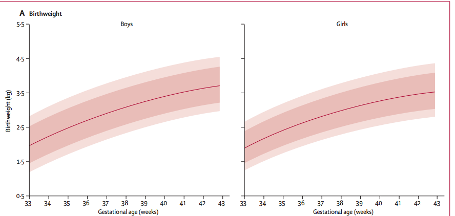
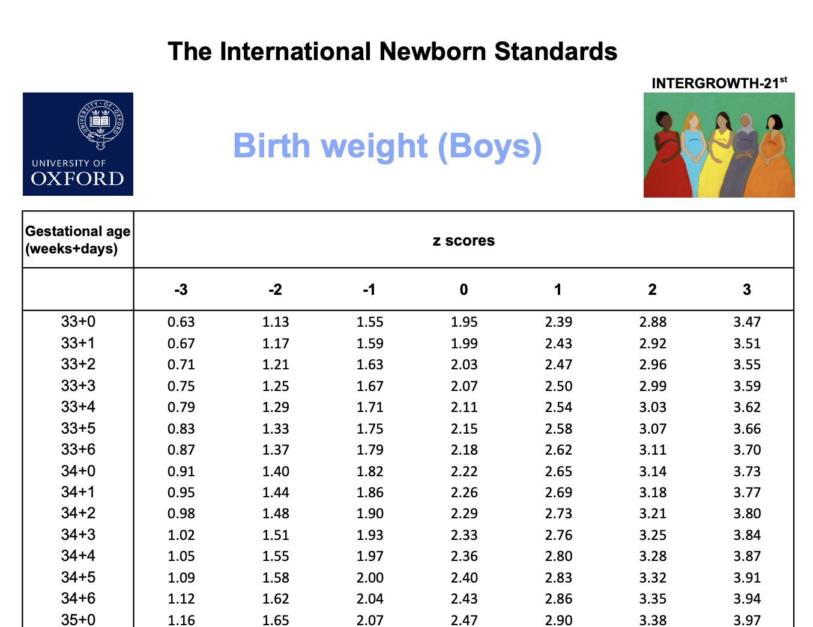

### Learning objectives for today

- Learn about the Normal distribution centered at $\mu$ with a standard deviation of $\sigma$
- Learn about the standard Normal distribution where $\mu=0$ and $\sigma=1$ and compute z-scores
- Calculate cumulative probabilities below or above a given value for any specified Normal distribution using R
- Perform simple calculations by hand (using the 68-95-99.7 rule)

### The Normal Distribution

- Here is the Normal distribution with mean of 0 ($\mu$) and standard deviation of 1 ($\sigma$).
- It is:
    - symmetric
    - centered at $\mu$
```{r first-sample-250-error, echo=F, eval=F}
## If you are getting an error message like the following:
# Error in Ops.data.frame(guide_loc, panel_loc) :
#‘==’ only defined for equally-sized data frames
## ... then the issue might be a stale version of the 'patchwork' library. 
## You may be able to clear it up by manually running the following *once*, and then restarting R:
remove.packages('patchwork')
install.packages('patchwork')
```
```{r load-libraries, echo=F, out.width = "50%", warning=F, message=F}
library(ggplot2)
library(patchwork)
library(latex2exp)
library(dplyr)

#students, you don't need to know how to use stat_function()
p1 <- ggplot(data = data.frame(x = c(-3, 3)), aes(x)) +
  stat_function(fun = dnorm, n = 101, args = list(mean = 0, sd = 1), col = "orange") +
  labs(y = "density") + 
  annotate("text", x = 0, y = 0.45, label = "mean = 0 \nsd = 1", check_overlap = T, col = "orange") +
  scale_x_continuous(limits = c(-5, 5)) + theme_minimal(base_size = 15)
## geom_text(aes(x = 0, y = 0.45), label = "mean = 0 \nsd = 1", check_overlap = T, col = "orange") +
p1
```

### The Normal Distribution

- Let's add another Normal distribution, this one centered at 2, with the same
standard deviation

```{r, echo=F, out.width="50%"}
p1 <- p1 + stat_function(fun = dnorm, n = 101, args = list(mean = 2, sd = 1), col = "blue") +
  annotate("text", label = "mean = 2 \nsd = 1", x = 2, y = 0.45, check_overlap = T, col = "blue") 
p1
```

### The Normal Distribution

- Let's add a third Normal distribution, this one centered at -2, with a standard
deviation of 0.5
- Notice how the distribution is narrowed (i.e., the spread is reduced)
- Why is the distribution "taller"?

```{r, echo=F, out.width="50%"}
p1 <- p1 + stat_function(fun = dnorm, n = 101, args = list(mean = -2, sd = 0.5), col = "forest green")  +
  annotate("text", x = -2, y = 0.85, label = "mean = -2 \nsd = 0.5", check_overlap = T, col = "forest green") 
p1
```

### The Normal Distribution

- Can you guess what a Normal distribution with $\mu=1$ and $\sigma=1.5$ would
look like compared to the others?

### The Normal Distribution

```{r, echo=F, out.width="50%"}
p1 <- p1 + stat_function(fun = dnorm, n = 101, args = list(mean = 1, sd = 1.5))  +
  annotate("text", x = 1, y = 0.3, label = "mean = 1 \nsd = 1.5", check_overlap = T) 
p1
```

### Properties of the Normal distribution

- the density can be drawn by knowing just two parameters , the mean ($\mu$) and SD ($\sigma$): $f(x)=\phi(x)=\frac{1}{\sigma \sqrt{2\pi}}e^{-\frac{1}{2}\left(\frac{x-\mu}{\sigma}\right)^2}$
- the mean $\mu$ can be any value, positive or negative
- the standard deviation $\sigma$ must be a positive number
- the mean is equal to the median (both = $\mu$)
- the standard deviation captures the spread of the distribution
- the area under the Normal distribution is equal to 1 (i.e., it is a density function)

### The 68-95-99.7 rule for all Normal distributions

- Approximately 68% of the data fall within one standard deviation of the mean
- Approximately 95% of the data fall within two standard deviations of the mean
- Approximately 99.7% of the data fall within three standard deviations of the mean

Written probabilistically:

- $P(\mu - \sigma < X < \mu + \sigma) \approx 68\%$
- $P(\mu - 2\sigma < X < \mu + 2\sigma) \approx 95\%$
- $P(\mu - 3\sigma < X < \mu + 3\sigma) \approx 99.7\%$

### Calculations using the 68-95-99.7 rule

Example 11.1 from Baldi & Moore on the heights of young women. The distribution 
of heights of young women is approximately Normal, with mean $\mu=64.5$ inches 
and standard deviation $\sigma=2.5$ inches.

- We use notation to represent when a random variable follows a specific 
distribution. For example, letting $H$ represent the random variable for the 
height of a young woman, we can then write $H \sim N(64.5, 2.5)$, to say that the
random variable $H$ follows a Normal distribution with a mean of 64.5 and a 
standard deviation of 2.5. 

```{r echo=F, out.width="50%"}
#students, you don't need to know this code

p1 <- ggplot(data = data.frame(x = c(56, 73)), aes(x)) +
  stat_function(fun = dnorm, args = list(mean = 64.5, sd = 2.5)) +
  geom_area(stat = "function", fun = dnorm, args = list(mean = 64.5, sd = 2.5), fill = "#ec7014", xlim = c(57, 72)) +
  geom_area(stat = "function", fun = dnorm, args = list(mean = 64.5, sd = 2.5), fill = "#fe9929", xlim = c(59.5, 69.5), alpha = 0.8) +
  geom_area(stat = "function", fun = dnorm, args = list(mean = 64.5, sd = 2.5), fill = "#fee391", xlim = c(62, 67), alpha = 0.8) +
  labs(y = "density", x = "") + 
  annotate("text", x = 64.5, y = 0.18, label = "mean = 64.5 \nsd = 2.5", check_overlap = T) +
  theme_minimal(base_size = 15) +
  annotate("segment", x = 64.5+2.5 , y = 0, xend = 64.5+2.5, yend = 0.1, lty = 1) +
  annotate("segment", x = 64.5-2.5 , y = 0, xend = 64.5-2.5, yend = 0.1, lty = 1) +
  annotate("segment",x = 64.5+2*2.5 , y = 0, xend = 64.5+2*2.5, yend = 0.1, lty = 2) +
  annotate("segment",x = 64.5-2*2.5 , y = 0, xend = 64.5-2*2.5, yend = 0.1, lty = 2) +
  annotate("segment",x = 64.5+3*2.5 , y = 0, xend = 64.5+3*2.5, yend = 0.1, lty = 3) +
  annotate("segment",x = 64.5-3*2.5 , y = 0, xend = 64.5-3*2.5, yend = 0.1, lty = 3) +
  scale_x_continuous(breaks = c(64.5-2*2.5, 64.5-2.5, 64.5, 64.5+2.5, 64.5+2*2.5), 
                     labels = c("59.5\n-2 SD", "62\n-1 SD", "64.5\nmean", "67\n+1 SD", "69.5\n+2 SD"),
                     limits = c(56, 73)) +
  annotate("segment",x = 64.5-2.5, xend = 64.5 + 2.5, y = 0.075, yend = 0.075) +
  annotate("label", x = 64.5, y = 0.075, label = "68%", fill = "#fee391") +
  annotate("segment",x = 64.5-2*2.5, xend = 64.5 + 2*2.5, y = 0.05, yend = 0.05, lty = 2) +
  annotate("label", x = 64.5, y = 0.05, label = "95%", fill = "#fe9929") +
  annotate("segment",x = 64.5-3*2.5, xend = 64.5 + 3*2.5, y = 0.025, yend = 0.025, lty = 3) +
  annotate("label", x = 64.5, y = 0.025, label = "99.7%", fill = "#ec7014")

p1
```

### Calculations using the 68-95-99.7 rule

- What calculations could you do with these data alone?
- $P(62 < H < 67)=?$
- $P(H > 62)=?$ `r # ans: 50% + 34% = 84%`

### The standard Normal distribution

- The standard Normal distribution is the Normal distribution with $\mu = 0$ and 
$\sigma=1$.
- We write: $N(0,1)$ to denote this distribution
- $X \sim N(0,1)$, implies that the random variable X is Normally distributed.

```{r, echo=F, out.width="50%"}
p1 <- ggplot(data = data.frame(x = c(-3, 3)), aes(x)) +
  stat_function(fun = dnorm, n = 101, args = list(mean = 0, sd = 1), col = "orange") +
  labs(y = "density", x = "") + 
  annotate("text", x = 0, y = 0.45, label = "mean = 0 \nsd = 1", check_overlap = T, col = "orange") +
  theme_minimal(base_size = 15) +
  annotate("segment", x = 0 , y = 0, xend = 0, yend = 0.4) +
  annotate("segment", x = 1 , y = 0, xend = 1, yend = 0.25, lty = 2) +
  annotate("segment", x = -1 , y = 0, xend = -1, yend = 0.25, lty = 2) +
  annotate("segment", x = 2 , y = 0, xend = 2, yend = 0.05, lty = 3) +
  annotate("segment", x = -2 , y = 0, xend = -2, yend = 0.05, lty = 3) +
  scale_x_continuous(breaks = -3:3, 
                     labels = c(-3, "-2\n-2 SD", "-1\n-1 SD", "0\nmean", "1\n+1 SD", "2\n+2 SD", 3))
p1
```

### Standardizing Normally distributed data

- Any random variable that follows a Normal distribution can be standardized.
This means we can transform its distribution from being centred at $\mu$ with a 
standard deviation of $\sigma$ to another Normal distributuin with $\mu=0$ and
standard deviation of $\sigma=1$
- If $x$ is an observation from a distribution that has a mean $\mu$ and a 
standard deviation $\sigma$, the standardized value of $x$ is calculated in the 
following way:

$$z = \frac{x-\mu}{\sigma}$$

- A standardized value is often called a **z-score**
- Interpretation: $z$ is the number of standard deviations that $x$ is above or
below the mean of the data.
- We standardize values so that we can have this interpretation, which is agnostic to the underlying mean, standard deviation, and units of measure. Standardizing Normally-distributed data is a quick way to determine if a specific value is much higher or lower than the average value.

### Standardizing Normally distributed data

```{r, out.width="50%", echo=F, fig.align='center'}

```
Source: [Intergrowth 21st Century](https://intergrowth21.tghn.org/)


### Standardizing Normally distributed data

In this image, the solid red line shows the average birthweight as a function 
of gestational age for boys and girls.

What is the approximate average birthweight in kilograms for a boy delivered at 
33 weeks?

```{r, out.width="50%", echo=F, fig.align='center'}

```

[Reference](https://intergrowth21.tghn.org/site_media/media/articles/newbornsize.pdf)

### Standardizing Normally distributed data

```{r, out.width="50%", echo=F, fig.align='center'}

```

- [Birthweight z-scores for boys](https://intergrowth21.tghn.org/site_media/media/articles/INTERGROWTH-21st_Birth_Weight_Z_Scores_Boys_1.pdf)
- How does this relate to what you see on the previous slide?

### Simulating Normally distributed data in R

Suppose that we measured 1000 heights for young women:

```{r simulate-height-data}
# students, rnorm() is important to know!
# this line of code generates 1000 rows of data from a Normal distribution with
# the specified mean and sd.
heights.women <- rnorm(n = 1000, mean = 64.5, sd = 2.5) 

# this line of code puts this variable into a data frame 
heights.women <- data.frame(heights.women)
```

We can plot the histogram of the heights, and see that they roughly follow from
a Normal distribution. The green curve is a Normal distribution, and the black curve is the density plot based on the actual data:

```{r plot heights, out.width="50%", echo=F, warning=F, message=F}
hist <- ggplot(heights.women, aes(x = heights.women)) +
  geom_histogram(col = "white") + 
  theme_minimal(base_size = 15) 

dens <- ggplot(heights.women, aes(x = heights.women)) + 
  geom_density() + 
  stat_function(fun = dnorm, args = c(mean = 64.5, sd = 2.5), col = "forest green") + 
  theme_minimal(base_size = 15)

hist + dens + plot_layout()
```

### Standardizing Normally distributed data in R

To standardize these data, we can apply the formula to compute the z-score:

```{r compute-z-value}
heights.women <- heights.women %>% mutate(mean = mean(heights.women), 
                                          sd = sd(heights.women), 
                                          z = (heights.women - mean)/sd)

head(heights.women)
```

What would the distribution of the standardized heights look like?

### Standardizing Normally distributed data in R

How are these plots different from the previous ones? Hint: look at the x axis.

```{r plot-z-scores, warning=F, message=F, out.width="50%", echo=F, }
hist_z <- ggplot(heights.women, aes(x = z)) + geom_histogram(col = "white") + 
  theme_minimal(base_size = 15) 

dens_z <- ggplot(heights.women, aes(x = z)) + geom_density() + 
  stat_function(fun = dnorm, args = c(mean = 0, sd = 1), col = "forest green") + 
  theme_minimal(base_size = 15)

hist_z + dens_z + plot_layout()
```

### Finding Normal probabilities

- A **cumulative probability** for a value x in a distribution is the proportion of 
observations in the distribution that lie at or below x.
- Here is the cumulative probability for x=1.2

```{r, out.width="50%", echo=F}
ggplot(data = data.frame(x = c(-4, 4)), aes(x)) +
  geom_area(stat = "function", fun = dnorm, args = list(mean = 0, sd = 1), fill = "#ec7014", xlim = c(-4, 1.2)) +
  theme_minimal(base_size = 15) +
  stat_function(fun = dnorm, args = list(mean = 0, sd = 1)) +
  geom_segment(x = 1.2, xend = 1.2, y = 0 , yend = 0.195) + 
  scale_x_continuous(breaks = -4:4) + 
  labs(y = "density")
```

### Plot of Cumulative Standard Normal Distribution
- There are different ways to display a distribution such as the density and the cumulative distribution
- The cumulative distribution can be shown as a graph of the probability of being below a value on the X-axis.
```{r, echo=F, out.width="50%", message=F}
p1 <- ggplot(data = data.frame(x = c(-3, 3)), aes(x)) +
  stat_function(fun = dnorm, n = 101, args = list(mean = 0, sd = 1), col = "orange") +
  labs(y = "density", x = "") + 
  annotate("text", x = 0, y = 0.45, label = "mean = 0 \nsd = 1", check_overlap = T, col = "orange") +
  theme_minimal(base_size = 15) +
  annotate("segment", x = 0 , y = 0, xend = 0, yend = 0.4) +
  annotate("segment", x = 1 , y = 0, xend = 1, yend = 0.25, lty = 2) +
  annotate("segment", x = -1 , y = 0, xend = -1, yend = 0.25, lty = 2) +
  annotate("segment", x = 2 , y = 0, xend = 2, yend = 0.05, lty = 3) +
  annotate("segment", x = -2 , y = 0, xend = -2, yend = 0.05, lty = 3) +
  scale_x_continuous(breaks = -3:3, 
                     labels = c(-3, "-2\n-2 SD", "-1\n-1 SD", "0\nmean", "1\n+1 SD", "2\n+2 SD", 3))

p2 <- ggplot(data = data.frame(x = c(-3, 3)), aes(x)) +
  stat_function(fun = pnorm, n = 101, args = list(mean = 0, sd = 1), col = "orange") +
  labs(y = "P(X < x)", x = "") + 
  theme_minimal(base_size = 15) +
  annotate("segment", x = 0 , y = 0, xend = 0, yend = pnorm(0,0,1)) +
  annotate("segment", x = 1 , y = 0, xend = 1, yend = pnorm(1,0,1), lty = 2) +
  annotate("segment", x = -1 , y = 0, xend = -1, yend = pnorm(-1,0,1), lty = 2) +
  annotate("segment", x = 2 , y = 0, xend = 2, yend = pnorm(2,0,1), lty = 3) +
  annotate("segment", x = -2 , y = 0, xend = -2, yend = pnorm(-2,0,1), lty = 3) +
  scale_x_continuous(breaks = -3:3, 
                     labels = c(-3, "-2\n-2 SD", "-1\n-1 SD", "0\nmean", "1\n+1 SD", "2\n+2 SD", 3))
library(cowplot)
plot_grid(p1,p2)
```


### Finding Normal probabilities

- Recall that 100% of the sample space for the random variable X lies under its 
probability density function.
- What is the amount of the area that is below x = 1.2?
- To answer this question we use the `pnorm()` function. (Think: the **p** in `pnorm` stands for probability):

```{r cumulative-prob-below}
pnorm(q = 1.2, mean = 0, sd = 1)
```

This says that approximately 88% of the probability lies below 1.2.

### Finding Normal probabilities

What if we wanted the reverse: P(x>1.2)?

```{r, out.width="50%", echo=F}
ggplot(data = data.frame(x = c(-4, 4)), aes(x)) +
  geom_area(stat = "function", fun = dnorm, args = list(mean = 0, sd = 1), fill = "#ec7014", xlim = c(1.2, 4)) +
  theme_minimal(base_size = 15) +
  stat_function(fun = dnorm, args = list(mean = 0, sd = 1)) +
  geom_segment(x = 1.2, xend = 1.2, y = 0 , yend = 0.195) + 
  scale_x_continuous(breaks = -4:4) + labs(y = "density")
```

```{r probability-above}
1 - pnorm(q = 1.2, mean = 0, sd = 1)
```

Alternatively: 

```{r alternative-prob-above}
 pnorm(q = 1.2, mean = 0, sd = 1, lower.tail = F)
```

So, 11.51% of the data is above x=1.2.

### Finding Normal probabilities

What if we wanted two "tail" probabilities?: $P(x< -1.2 \text{ or } x>1.2)$?

```{r, echo=F, out.width="50%"}
ggplot(data = data.frame(x = c(-4, 4)), aes(x)) +
  geom_area(stat = "function", fun = dnorm, args = list(mean = 0, sd = 1), fill = "#ec7014", xlim = c(1.2, 4)) +
  geom_area(stat = "function", fun = dnorm, args = list(mean = 0, sd = 1), fill = "#ec7014", xlim = c(-4, -1.2)) +
  theme_minimal(base_size = 15) +
  stat_function(fun = dnorm, args = list(mean = 0, sd = 1)) +
  geom_segment(x = 1.2, xend = 1.2, y = 0 , yend = 0.195) + 
  geom_segment(x = -1.2, xend = -1.2, y = 0 , yend = 0.195) + 
  scale_x_continuous(breaks = -4:4) + labs(y = "density")
```

### Finding Normal probabilities

The trick: find one of the tails and then double the area because the distribution
is symmetric:

```{r}
pnorm(q = -1.2, mean = 0, sd = 1)*2
```

### Finding Normal probabilities

What if we wanted a range in the middle?: $P(-0.8 < x < 1.5)$?

```{r, echo=F, out.width="50%"}
ggplot(data = data.frame(x = c(-4, 4)), aes(x)) +
  geom_area(stat = "function", fun = dnorm, args = list(mean = 0, sd = 1), fill = "#ec7014", xlim = c(-0.8, 1.5)) +
  theme_minimal(base_size = 15) +
  stat_function(fun = dnorm, args = list(mean = 0, sd = 1)) +
  geom_segment(x = 1.5, xend = 1.5, y = 0 , yend = 0.13) + 
  geom_segment(x = -0.8, xend = -0.8, y = 0 , yend = 0.29) + 
  scale_x_continuous(breaks = -4:4) + labs(y = "density")
```

### Finding Normal probabilities

```{r}
# step 1: calculate the probability *below* the upper bound (x=1.5)
pnorm(q = 1.5, mean = 0, sd = 1)

# step 2: calculate the probability *below* the lower bound (x = -0.8)
pnorm(q = -0.8, mean = 0, sd = 1)

# step 3: take the difference between these probabilities to get what's left in 
# the middle
pnorm(q = 1.5, mean = 0, sd = 1) - pnorm(q = -0.8, mean = 0, sd = 1)
```

Thus, 72.13% of the data is in the range -0.8 < x < 1.5.

### Your turn

To diagnose osteoporosis, bone mineral density is measured. The WHO criterion for 
osteoporosis is a BMD score below -2.5. Women in their 70s have a much lower BMD
than younger women. Their BMD ~ N(-2, 1). What proportion of these women have a
BMD below the WHO cutoff?

Hint: you do not need to find a z-score!

```{r osteoporosis}
#to fill in during class
pnorm(q=-2.5, mean = -2, sd = 1)
```

### Recap of functions used

- `rnorm(n = 100, mean = 2, sd = 0.4)`, to generate Normally distributed data 
from the specified distribution
- `pnorm(q = 1.2, mean = 0, sd = 2)`, to calculate the cumulative probability below
a given value