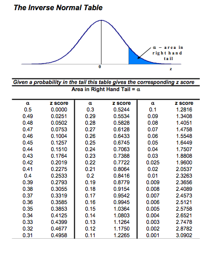

```{r load-libraries, echo=F, out.width = "80%", warning=F, message=F}
library(ggplot2)
library(patchwork)
library(latex2exp)
library(dplyr)
```

### Learning objectives for today

- Calculate the quantile for a specified cumulative probability for any specified Normal distribution using R
- Learn about Q-Q plots and how to use them to assess whether a variable is Normally distributed

### Finding Normal percentiles

Recap: Last class, we have calculated the *probability* using `pnorm()` given 
specific values for x.

Sometimes we want to go in the opposite direction: We might be given the 
probability within some range and tasked with finding the corresponding x-values.

```{r, echo=F, message=F}

p1 <- ggplot(data = data.frame(x = c(30,60)), aes(x)) +
    stat_function(fun = dnorm, n = 101, args = list(mean = 45, sd = 4), col = "blue") +
    labs(y = "f(x)", x = "x") + 
    geom_text(aes(x = 35,y = 0.090), label = "N(45,4) density", check_overlap = T, col = "black") +
    scale_x_continuous(breaks = seq(30, 60, by = 4)) + 
    scale_y_continuous(breaks = seq(0, 0.1, by = 0.01)) +
     theme_minimal(base_size = 15)

p2 <- ggplot(data = data.frame(x = c(30,60)), aes(x)) +
  stat_function(fun = pnorm, n = 101, args = list(mean = 45, sd = 4), col = "blue") +
  labs(y = "P(X < x)", x = "x") + 
  geom_text(aes(x = 37,y = 0.9), label = "N(45,4) Cumulative Dist", check_overlap = T, col = "black") +
  theme_minimal(base_size = 15) +
  scale_x_continuous(breaks = seq(30, 60, by = 4)) +
  scale_y_continuous(breaks = seq(0, 1, by = 0.1)) 
  
  
library(cowplot)
plot_grid(p1,p2)
```


### Finding Normal percentiles

Example: The hatching weights of commercial chickens can be modeled accurately
using a Normal distribution with mean $\mu=45$ grams and standard deviation 
$\sigma=4$ grams. What is the third quartile of the distribution of hatching 
weights?

That is, what is the x such that 75% of the probability is below it?


```{r, echo=F, out.width="80%"}
ggplot(data = data.frame(x = c(29, 61)), aes(x)) +
  geom_area(stat = "function", fun = dnorm, args = list(mean = 45, sd = 4), fill = "#ec7014", xlim = c(29, 47.7)) +
  theme_minimal(base_size = 15) +
  stat_function(fun = dnorm, args = list(mean = 45, sd = 4)) +
  geom_segment(x = 47.69796, xend = 47.69796, y = 0 , yend = 0.08) + 
  labs(y = "density") +
  geom_text(aes(x = 44, y = 0.05), check_overlap = T, label = "75%", col = "white", size = 8) 
```


### Finding Normal percentiles using the `qnorm()` function

Example: The hatching weights of commercial chickens can be modeled accurately
using a Normal distribution with mean $\mu=45$ grams and standard deviation 
$\sigma=4$ grams. What is the third quartile of the distribution of hatching 
weights?

```{r}
qnorm(p = 0.75, mean = 45, sd = 4)
```

Thus, 75% of the data is below 47.7 for this distribution.

### Using the standard Normal table

- Before we had easy access to computers and software people would use printed 
out tables to compute probabilities
- We can ignore this section of the textbook because we will always have R to 
do the calculations for us

```{r, out.width="80%", echo=F, fig.align='center'}

```


### The Normal quantile plot (a.k.a the Q-Q plot)
- The purpose of making a Q-Q plot is to examine whether a continuous variable 
follows a Normal distribution 

- If you want to know whether a variable is Normally distributed you could 
examine its histogram to see if it is unimodal and symmetric. However, it is 
still sometimes hard to say if it is truly Normal. To do so we use a Q-Q plot.

### Are these data Normally distributed?

- The data is unimodal and symmetric, but is its distribution Normal?

```{r, echo=F, out.width="80%"}
set.seed(123)
example_data <- data.frame(y = rt(200, df = 5) + 3)

ggplot(example_data, aes(y)) + geom_histogram(col = "white") +
  theme_minimal(base_size = 15)
```

### Basic idea of a Normal quantile plot

1. Arrange the observed data values from smallest to largest. Record what 
percentile of the data each value occupies. For example, the smallest observation
in a set of 20 is at the 5% point, the second smallest is at the 10% point, and 
so on.

2. Do Normal distribution calculations to find z-scored at these same percentiles. For example, z = -1.645 is the 5% point of the standard Normal 
distribution, and z = -1.282 is the 10% point.

3. Plot each data point x against the corresponding z. If the data distribution
is close to standard Normal, the plotted points will lie close to the 45-degree 
line x=z. If the data distribution is close to any normal distribution, the 
plots points will lie close to some straight line. 

Any Normally distributed data set will produce a straight line on a Normal quantile plot, because the data distribution and the z distribution are both
Normal and their relationship is thus linear. If the data are not Normally distributed, the data and the z distribution are unrelated, and a Normal quantile
plot will not be linear. 

### Easy way to make a qqplot() where R does all the calculating for you

Looking at this plot, does the pattern in the data lie on a straight line?

```{r, out.width="80%", fig.align=T}
 ggplot(example_data, aes(sample = y)) + 
  stat_qq() +
  stat_qq_line() +
  theme_minimal() 
```

It does in the middle values of the data, but not at the tails. This means that
the original variable is not Normally distributed.

### Code template

```{r, eval = F}
#students, make sure to remove `eval=F` if you copy this code chunk
ggplot(your_data, aes(sample = your_var)) +
  stat_qq() +
  stat_qq_line() +
  theme_minimal()
```

### Another example

Recall the seed data:

```{r}
library(readr)
seed_data <- read_csv("./data/Ch04_seed-data")

head(seed_data)
```
Is the distribution of `seed_count` Normal?

### Another example

Check out its distribution. It definitely does not look normal:

```{r, out.width="80%", fig.align='center'}
ggplot(seed_data, aes(x = seed_count)) + 
  geom_histogram(col = "white") + 
  theme_minimal(base_size = 15)
```

### Another example

And look at its Q-Q plot. Does the data appear to follow a Normal distribution? 

```{r}
ggplot(seed_data, aes(sample = seed_count)) + 
  stat_qq() + stat_qq_line() + 
  theme_minimal(base_size = 15)
```

These data definitely do not follow a straight line - there is a curved pattern shown in the plot.

### Another example (logged)

You might remember that we took the log of seed_count before we used it in regression.

```{r}
ggplot(seed_data, aes(x = log(seed_count))) + 
  geom_histogram(col = "white", binwidth = 2) + 
  theme_minimal(base_size = 15)
```

### Another example (logged)

How does the Q-Q plot look for the logged variable?

```{r}
ggplot(seed_data, aes(sample = log(seed_count))) + 
  stat_qq() + stat_qq_line() + 
  theme_minimal(base_size = 15) + scale_y_continuous(limits = c(0, 15)) 
```

Once we log transformed the data, the values now follow a Normal distribution

```{r, echo = F}
#students do not need to know the code in this chunk
n <- 1000
gaussian_rv <- rnorm(n)
skew_right <- c(gaussian_rv[gaussian_rv > 0] * 2.5, gaussian_rv)
sr <-data.frame(skew_right)
skew_left <- c(gaussian_rv[gaussian_rv < 0]*2.5, gaussian_rv)
sl <-data.frame(skew_left)

wide_tails <- c(gaussian_rv*2.5, gaussian_rv)
wt <- data.frame(wide_tails)

bimodal <- c(rnorm(500, -1, .25), rnorm(500, 1, .25))
bi <- data.frame(bimodal)
```

### Normal quantile plot when data is skewed right

```{r, message=FALSE, warning=F}
a <- ggplot(sr, aes(x = skew_right)) + 
  geom_histogram(col = "white", bins = 50) +
  theme_minimal(base_size = 15)

b <- ggplot(sr, aes(sample = skew_right)) + 
  stat_qq() + 
  stat_qq_line() +
  theme_minimal(base_size = 15)

library(patchwork)

a + b + plot_layout()
```

### Normal quantile plot when data is skewed left

```{r, message=FALSE, warning=F}
a <- ggplot(sl, aes(x = skew_left)) + 
  geom_histogram(col = "white", bins = 50) +
  theme_minimal(base_size = 15)

b <- ggplot(sl, aes(sample = skew_left)) + 
  stat_qq() + 
  stat_qq_line() +
  theme_minimal(base_size = 15)

a + b + plot_layout()
```

### Normal quantile plot when data has "wide tails"

```{r}
e <- ggplot(wt, aes(x = wide_tails)) + 
  geom_histogram(col = "white", bins = 50) +
  theme_minimal(base_size = 15) + labs(title = "Wide tails")

f <- ggplot(wt, aes(sample = wide_tails)) + 
  stat_qq() + 
  stat_qq_line() +
  theme_minimal(base_size = 15) + labs(title = "Wide tails qq plot")

e + f + plot_layout() 
```

### Normal quantile plot when data is bimodal

```{r}
g <- ggplot(bi, aes(x = bimodal)) + 
  geom_histogram(col = "white", bins = 50) +
  theme_minimal(base_size = 15) + labs(title = "Bimodal distribution")

h <- ggplot(bi, aes(sample = bimodal)) + 
  stat_qq() + 
  stat_qq_line() +
  theme_minimal(base_size = 15) + labs(title = "Bimodal distribution")

g + h + plot_layout() 

```

### Reference

- Read [this blog post](http://seankross.com/2016/02/29/A-Q-Q-Plot-Dissection-Kit.html) 
by Sean Kross (up to and including the Takeaways). 

- You can read this if you want, but you don't need to.

### Recap of functions used

- `qnorm(p = 0.75, mean = 0, sd = 1)` to calculate the x-value for which some 
percent of the data lies below it
- `stat_qq()` and `stat_qq_line()` to make a Q-Q plot. Notice also that `aes(sample = var1)`
is needed

