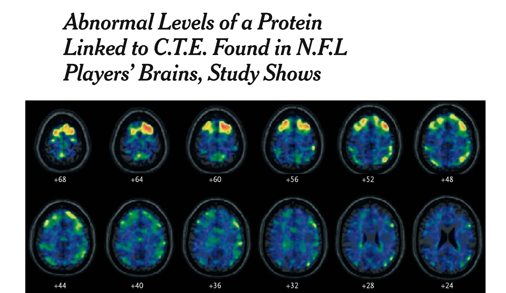
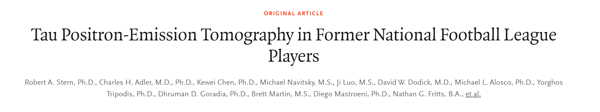
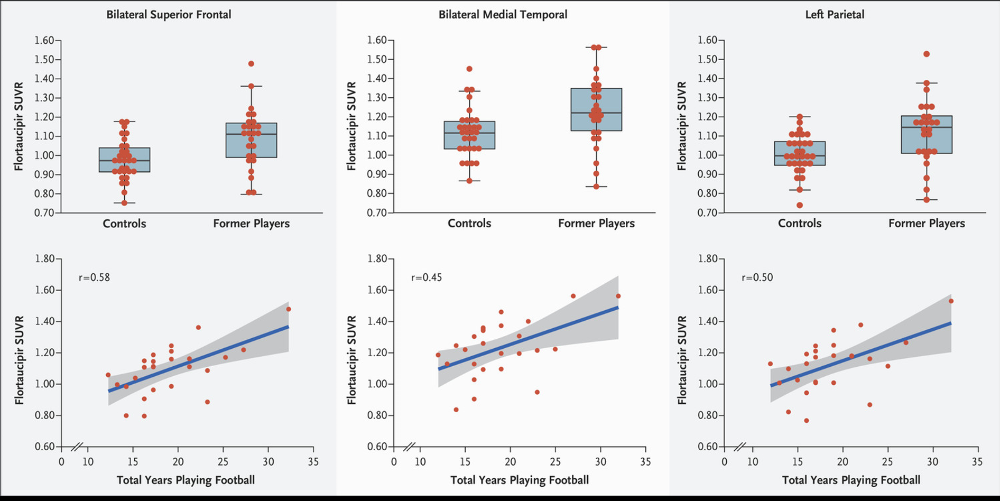
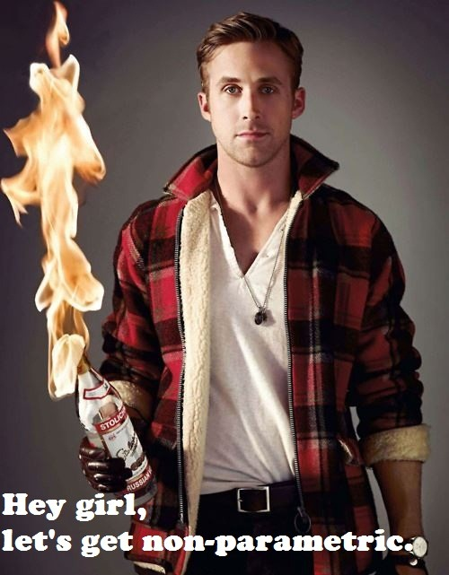
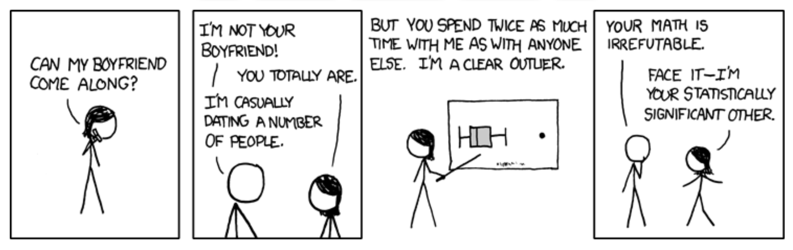

<!-- libraries -->
```{r,include=FALSE,purl=FALSE, warning=FALSE, message=FALSE}
library(knitr) # for include_graphics() 
library(dplyr)
library(forcats)
library(ggplot2)
```


<!-- libraries -->
```{r,include=FALSE,purl=FALSE}
library(knitr) # for include_graphics() 
library(dplyr)
library(forcats)
library(readr)
library(ggplot2)
library(broom) 
library(tidyr)
library(ggplot2)
library(tibble)
```

### Concussions
```{r con1, fig.align='center', out.width="50%", echo=FALSE }

```

### Article on Concussions
```{r con2, fig.align='center', out.width="80%", echo=FALSE }

```

[New York Times, April 10, 2019](https://www.nytimes.com/2019/04/10/health/concussion-nfl-football-cte.html)

### From the article:

```{r con3, fig.align='center', out.width="70%", echo=FALSE }

```
"The authors of the study and outside experts stressed that such tau imaging is far from a diagnostic test for C.T.E., which is likely years away and could include other markers, from blood and spinal fluid."

"The results of the study, published in The New England Journal of Medicine on Wednesday, are considered preliminary, but constitute a first step toward developing a clinical test to determine the presence of C.T.E. in living players, as well as early signs and potential risk."


### From the article
STATISTICAL ANALYSIS
Between-group comparisons of age, years of education, and MMSE scores were analyzed with **Mann–Whitney U tests**. Group differences in race were analyzed with the use of chi-square tests. For between-group comparisons of amyloid-beta plaque burden, chi-square tests were used to compare the proportion of participants with a positive florbetapir PET, and **t-tests** were used to compare the mean cortical:cerebellar florbetapir standard uptake value ratio (SUVR, the ratio of radioactivity in a cerebral region to that in the cerebellum as a reference) between the groups. 

### From the article

```{r con4, fig.align='center', out.width="70%", echo=FALSE }

```


### Roadmap
Parametric Testing:

- One sample comparison to a mean (one sample t-test)
- Two independent samples (two sample t-test)
- Two non-independent samples (paired t-test)
- Multiple samples/groups (ANOVA)
  - Bonferroni
  - Tukey's HSD


### Roadmap
But all of the methods we have looked at so far depend on some assumptions about the underlying distribution.

What have we assumed?

What do we do if our assumptions are violated?
  
## Non-Parametric Testing

### Non-Parametric Testing
From http://biostatisticsryangoslingreturns.tumblr.com/
```{r nonpara, fig.align='center', out.width="40%", echo=FALSE }

```


### Non-Parametric Testing
**PROS**: Non-parametric methods make very few assumptions about the variable(s) we samples or their distribution and thus rely less on “parameters”.

- Use a ranking of the data instead of actual values
- Do not assume a normal distribution of the data
- Less sensitive to outliers and skewed data
- Do not need a large sample size (sometimes)

**CONS**: Non-parametric methods use less of the information offered in the data

- If the assumptions for a parametric test are met and a non-parametric test is used, it will have lower power (probability of detecting a false null hypothesis)
- They are less specific in what they test (e.g., independence)


### Non-Parametric Testing
We will discuss non-parametric equivalents for:

Two sample t :  Wilcoxon Rank-Sum

Paired t : Wilcoxon sign-rank

ANOVA:  Kruskal-Wallis

## Wilcoxon Two-Sample Tests

### Frank Wilcoxon
```{r wilcox, fig.align='center', out.width="60%", echo=FALSE }

```

In one paper in 1945 he proposed both the Wilcoxon rank-sum test and the Wilcoxon signed-rank test.

### Wilcoxon Rank-Sum
- Sometimes also called the Mann-Whitney U test
- Non-parametric test for comparing two independent samples with a continuous outcome
- This is the non-parametric counterpart of the two sample t-test 
- Assumes that the distributions have the same general shape but assumes nothing about that shape
- Evaluates the null hypothesis that the two population distributions are identical

### Wilcoxon Rank-Sum
To calculate a rank sum test:

1. The observations from both groups are ordered from lowest to highest and assigned the **rank** of their order

2. If there are "tied" values, these are assigned the average of the ranks
   - E.g., if two observations have the same value and the next lower value has a rank of three, then the two observations are both given the rank of 4.5 (because they would have been ranks 4 and 5)

3. Then the sum of ranks belonging to Group 1 are compared to the sum of ranks belonging to Group 2


### Wilcoxon Rank-Sum
Values in group 1:  4, 3, 5, 2, 6

Values in group 2:  6, 5, 7, 4, 8

### Wilcoxon Rank-Sum: Ranking

|        |   |   |     |     |     |     |     |     |   |    |
|--------|---|---|-----|-----|-----|-----|-----|-----|---|----|
| Number | 2 | 3 | 4   | 4   | 5   | 5   | 6   | 6   | 7 | 8  |
| Index  | 1 | 2 | 3   | 4   | 5   | 6   | 7   | 8   | 9 | 10 |
| Rank   | 1 | 2 | 3.5 | 3.5 | 5.5 | 5.5 | 7.5 | 7.5 | 9 | 10 | 
|--------|---|---|-----|-----|-----|-----|-----|-----|---|----|

### Wilcoxon Rank-Sum: Summation

|Group 1 |rank  |  Group 2 | rank       |
|---------|------|---------------|-----------|
|4        |3.5    |6              | 7.5        |
|3        |2      |5              | 5.5        |
|5        |5.5    |7              | 9          |
|2        |1      |4              |3.5         |
|6        |7.5    |8              |10          |
|---------|------|---------------|-----------|
|sum      | 19.5    | sum              |35.5   |

### Wilcoxon Rank-Sum
The smaller of the two sums is called W, with size of $n_S$, and the larger with size $n_L$.  This is then used in the following equation to generate a Z statistic.

$$Z_{w}=\frac{W-\mu_w}{\sigma_{w}}$$
where

$$\mu_w=\frac{n_S(n_S+n_L+1)}{2}$$
and

$$\sigma_{w}=\sqrt{\frac{n_Sn_L(n_S+n_L+1)}{12}}$$

### Wilcoxon Rank-Sum
So from our example where group 1 had a rank sum of 19.5 and group 2 had a rank sum of 35.5

$$\mu_w=\frac{n_S(n_S+n_L+1)}{2}=\frac{5(5+5+1)}{2}=27.5$$
and

$$\sigma_{w}=\sqrt{\frac{n_Sn_L(n_S+n_L+1)}{12}}=\sqrt{\frac{5\times5(5+5+1)}{12}}=4.8$$

$$Z_{w}=\frac{W-\mu_w}{\sigma_{w}}=\frac{19.5-27.5}{4.8}=-1.67$$

### Wilcoxon Rank-Sum
The $Z_{w}$ we generate follows an approximate standard Normal distribution.
So we can use our Z score to get a p-value in R
```{r, echo=TRUE}
2*pnorm(-1.67)
```


### Wilcoxon Rank-Sum in R

The general syntax will be:

`wilcox.test(group1, group2, paired=F)`

or 

`wilcox.test(outcome ~ group)`

Remember that you can always type `help(wilcox.test)` in your console to get the full details.


### Wilcoxon Rank-Sum example: Phenylketonuria 
Normalized mental age scores for children with phenylketonuria (PKU):

Group 1:  "low exposure" < 10.0 mg/dl

Group 2:  "high exposure" >= 10.0 mg/dl


### Wilcoxon Rank-Sum: Phenylketonuria 
```{r read pku, echo=FALSE}
nMA<- c(34.5, 37.5, 39.5, 40,45.5, 47,47,47.5,48.7, 49, 51,51,52,53,54,54,55,56.5,57,58.5,58.5,28,35,37,37,43.5,44,45.5,46,48,48.3,48.7,51,52,53,53,54,54,55)
Group<-c((rep("low",21)),rep("high",18))

pku <- data.frame(Group,nMA)
head(pku)
```


### Wilcoxon Rank-Sum: Phenylketonuria 
In this example there 18 High and 21 Low exposure individuals.
```{r}
group_by(pku,Group) %>%
  summarise(
    count = n(),
    median = median(nMA, na.rm = TRUE),
    IQR = IQR(nMA, na.rm = TRUE)
  )
```

### Wilcoxon Rank-Sum: Phenylketonuria
If we graph the distributions with a density plot what do we notice?
```{r, echo=TRUE, out.width="50%", fig.align='center'}
ggplot(pku, aes(x = nMA)) + 
  geom_density(aes(fill = Group), alpha = 0.5) +
  theme_minimal(base_size = 15)
```

### Wilcoxon Rank-Sum: Phenylketonuria
```{r, echo=TRUE, message=F, warning=FALSE}
wilcox.test(nMA ~ Group, data=pku)
```

### Wilcoxon Rank-Sum vs T: NHANES example
Here I will again use the NHANES data as an example, looking at height by gender:
```{r read, echo=TRUE}
# Read CSV into R
nhanes <- read.csv(file="./data/nhanes.csv", header=TRUE, sep=",")
names(nhanes)
```


### Wilcoxon Rank-Sum vs T: NHANES example
```{r wil1, echo=FALSE, out.width="50%"}
boxplot(bmxht~gender,data=nhanes, main="Height in cm by gender")
malesht <- nhanes$bmxht[nhanes$gender=="Male"]
femalesht <- nhanes$bmxht[nhanes$gender=="Female"]
```

### Wilcoxon Rank-Sum vs T
```{r, echo=TRUE, out.width="60%", fig.align='center', message=FALSE, warning=FALSE}
ggplot(nhanes, aes(x = bmxht)) + 
  geom_density(aes(fill=gender), alpha=0.1) +
  theme_minimal(base_size = 15)
```

### Wilcoxon Rank-Sum vs T
```{r wil2, echo=TRUE}
t.test(malesht, femalesht, paired=F)
```


### Wilcoxon Rank-Sum vs T
```{r wilvst, echo=TRUE}
wilcox.test(malesht,femalesht)
```


### Wilcoxon Rank-Sum vs T
- When the sample size is quite large (as with these NHANES data)  the assumption of approximate normality (due to CLT) is reasonable one and the results of the hypothesis testing will generally not be different using a parametric or non-parametric approach.
- In smaller sample sizes, with potential outliers, can get more reliable results using Wilcoxon (exact version) than equivalent t-test


## Wilcoxon Sign Rank

### Wilcoxon Sign Rank
- Non-parametric test for comparing two non-independent (paired) sample means
- This is the non-parametric counterpart of the paired t-test
- Assumes that the distributions have the same general shape but assumes nothing about that shape
- Evaluates the null hypothesis that the difference between the paired values is 0

### Wilcoxon Sign Rank
Steps:

1) Calculate the difference between each pair of observations 

2) Rank the difference by absolute value from smallest to largest (again, tied values get the average of the ranks).  Any pair where there is no difference is thrown out.

3) Record the "sign" of the difference (i.e., positive or negative )

4) Take the sum of the positive ranks and the sum of the negative ranks (the smaller sum is denoted with a `T`)


### Wilcoxon Sign Rank
Under the null hypothesis that the difference is zero, we would expect the sample to have equal numbers of positive and negative ranks with equivalent sums.  This expectation is tested against the statistic
$$Z_{T}=\frac{T-\mu_{T}}{\sigma_{T}}$$

Where
$$\mu_{T}=\frac{n(n+1)}{4}$$
and 
$$\sigma_{T}=\sqrt{\frac{n(n+1)(2n+1)}{24}}$$


### Wilcoxon Sign Rank:  Example Pre- and Post-Test
```{r sign, echo=FALSE}
Change<-c(12,13,-2,-1,10,-3,-1,13,-1,-2,20,28,0)
test1<-c(65,87,77,90,70,84,92,83,85,91,68,72,81)
test2<-c(77,100,75,89,80,81,91,96,84,89,88,100,81)
prepost<-data.frame(Change,test1,test2)
```

|Time 1 |Time 2|
|---------|------|
|65       |77   |
|87       |100     |
|77        |75    |
|90       |89      |
|70       |80    |
|84       |81    |
|92       |91    |
|83       |96    |
|85       |84    |
|91       |89    |
|68       |88    |
|72       |100    |
|81       |81    |
|---------|------|

### Sign Rank Example
```{r, echo=FALSE, out.width="60%", fig.align='center', message=FALSE, warning=FALSE}
ggplot(prepost) + 
  geom_density(aes(test1), col="blue") +
  geom_density(aes(test2), col="green") +
  theme_minimal(base_size = 15)
```

### Sign Rank Example: Calculate Difference and Sign


|Time 1 |Time 2| Difference | sign |
|---------|------|----------|------|
|65       |77    |12  |+|
|87       |100   |13  |+|
|77        |75   |-2  |-|
|90       |89    |-1  |-|
|70       |80    |10  |+|
|84       |81    |-3  |-|
|92       |91    |-1  |-|
|83       |96    |13  |+|
|85       |84    |-1  |-|
|91       |89    |-2  |-|
|68       |88    |20  |+|
|72       |100   |18  |+|
|81       |81    |0   |?|
|---------|------|----|------|

### Sign Rank Example: Sort by Absolute Value and Assign Rank

|Time 1 |Time 2| Difference | sign | rank|
|---------|------|----------|------|-----|
|90       |89   |-1  |-|2|
|92       |91   |-1  |-|2|
|85       |84   |-1  |-|2|
|77       |75    |-2  |-|4.5|
|91       |89    |-2  |-|4.5|
|84       |81    |-3  |-|6|
|70       |80    |10  |+|7|
|65       |77    |12  |+|8|
|87       |100  |13  |+|9.5|
|83       |96   |13  |+|9.5|
|72       |100    |18  |+|11|
|68       |88   |20  |+|12|
|81       |81    |0   |?|**drop**|
|---------|------|----|------|
 
### Sign Rank Example: Sum the Positive and Negative Ranks
Negative signs 

|Time 1 |Time 2| Difference | sign | rank|
|---------|------|----------|------|-----|
|90       |89   |-1  |-|2|
|92       |91   |-1  |-|2|
|85       |84   |-1  |-|2|
|77       |75    |-2  |-|4.5|
|91       |89    |-2  |-|4.5|
|84       |81    |-3  |-|6|
|---------|------|----|------|

Sum of negative sign ranks is 21.

### Sign Rank Example: Sum the Positive and Negative Ranks

|Time 1 |Time 2| Difference | sign | rank|
|---------|------|----------|------|-----|
|70       |80    |10  |+|7|
|65       |77    |12  |+|8|
|87       |100  |13  |+|9.5|
|83       |96   |13  |+|9.5|
|72       |100    |18  |+|11|
|68       |88   |20  |+|12|
|---------|------|----|------|

Sum of the positive sign ranks is 57.


### Wilcoxon Sign Rank:  Example
Our expectation would be:
$$\mu_{T}=\frac{n(n+1)}{4}=\frac{12(12+1)}{4}=39$$
**Remember that we had 13 observations, but we dropped one because the values at times 1 and 2 were the same**
and 
$$\sigma_{T}=\sqrt{\frac{n(n+1)(2n+1)}{24}}=\sqrt{\frac{12(12+1)(2\times12+1)}{24}}=12.75$$

### Wilcoxon Sign Rank:  Example
And we compare our expectation to the smaller rank value (Sum of negative ranks was 21, sum of positive ranks was 57):
$$Z_{T}=\frac{T-\mu_{T}}{\sigma_{T}}=\frac{21-39}{12.75}=-1.412$$

```{r, echo=TRUE}
2*pnorm(-1.412)
```

### Wilcoxon Rank-Sum in R

The general syntax will be:

`wilcox.test(group1, group2, paired=T)`

or 

`wilcox.test(Pair(group,outcome) ~ 1)`


### Wilcoxon Sign Rank:  Example

```{r, sign2, echo=TRUE}
wilcox.test(test1,test2,paired=T, correct=FALSE)
```

### Wilcox Sign Rank: Compare to T
```{r spairt,echo=TRUE}
t.test(test1,test2,paired=TRUE)
```

### Wilcox Sign Rank:  Compare to T
With this study, our sample size is 13 (one pair is thrown out for having a difference of zero) and the distribution of changes looks like this:
```{r wtot, echo=TRUE, out.width="50%", fig.align='center',out.height="50%"}
hist(Change)
```


## Non-parametric Test for Three or More Samples

### Kruskal-Wallis
- The Kruskal-Wallis test is a non-parametric alternative to the ANOVA test
- Kruskal-Wallis looks at the medians of the groups, not the means, and tests if one or more are significantly different from the rest (but does not report which one):
  - $H_{0}$: There is no difference between the group medians
  - $H_{1}$: There is a statistically-significant difference in the group medians

### Kruskal-Wallis

- This test can be thought of as an extension of the Wilcoxon Rank-Sum test
- We will not do this one by hand
- In R the syntax is generally:
  `kruskal.test(outcome ~ group, dataset)`

### Kruskal-Wallis
```{r, echo=FALSE}
##students you could tinker with this code to see what happens if you add outliers, or shift the outcomes for a group
treatment <- c(rep("Group1", 4), rep("Group2", 5), rep("Group3", 6), rep("Group4", 7))
outcome <- c(30, 46, 99, 95,  # group1
                  3, 14, 16, 41, 47, #group2
                  5, 4, 4, 4, 10, 9, #group3
                  24, 30, 43, 51, 62, 32, 96 ) #group4 

KW_data <- data.frame(treatment, outcome)
kruskal.test(outcome~ treatment, data=KW_data)
```

### Non-Parametric Summary

- Most parametric tests have an analogous non-parametric test
- We have covered the following:

|Samples |Parametric | Non Parametric       |
|---------------|----------------|-------------------------|
| Two independent samples   | two sample t-test       | Wilcoxon rank sum|
| Two paired samples        | paired t-test |  Wilcoxon sign rank      |
| Three or more samples     | ANOVA     | Kruskal-Wallis |

### Non parametrics in R


|Samples |test name | R function       |
|---------------|---------------|-------------------------|
| Two independent samples   |  Wilcoxon rank sum| `wilcox.test(group1,group2,paired=F)` |
| Two paired samples        | Wilcoxon sign rank      | `wilcox.test(Pair(group1,group2) ~ 1)` |
| Three or more samples     |  Kruskal-Wallis | `kruskal.test(outcome ~ group)` |


### Parting humor
```{r, fig.align='center', out.width="50%", echo=FALSE }

```

